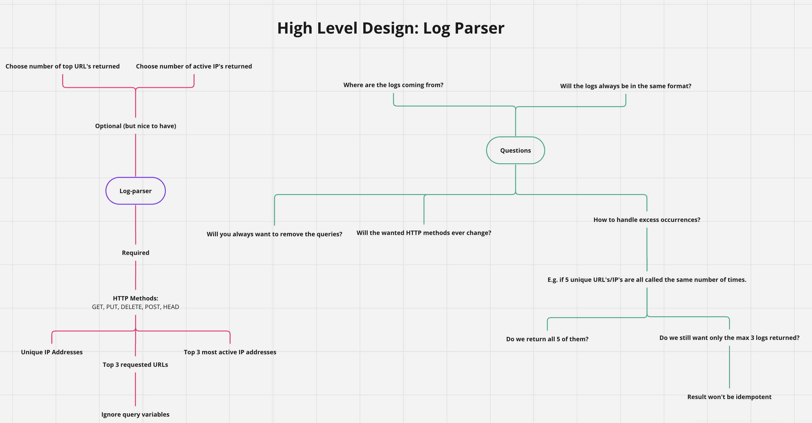

# Log Parser

## Overview

### High Level Design



Log Parser counts the unique IP addresses, top most requested URL's, and the most active IP addresses for the following HTTP methods:

```text
GET, PUT, DELETE, POST, HEAD
```

[Config](config/config.json) can be configured with different inputs.
Default:

- the requested number of IPs/URLs to return
  - both are set to 3
- regex pattern to match
  - captures IP's and URLS(ignores any query) with the HTTP methods: GET, PUT, DELETE, POST, HEAD
- File path to the logs
  - logs/log_file.log

The format of the logs will need to be in:

```text
$ip_address ......... $http_method $url_path
```

- Note: the default regex pattern captures the IP and URL (but the http_method is a non-capturing group)

E.g

```text
177.71.128.21 - - [10/Jul/2018:22:22:08 +0200] "GET /blog/2018/08/survey-your-opinion-matters/ HTTP/1.1" 200 3574 "-" "Mozilla/5.0 (Windows NT 6.1; WOW64) AppleWebKit/536.6 (KHTML, like Gecko) Chrome/20.0.1092.0 Safari/536.6"
```

## Assumptions/Designs

Initial Design

- Log Parser will always be in the same format
- Logs stored in logs/log_file.log
- Will always want to ignore a query in a url path
- HTTP methods wanted: `GET, PUT, DELETE, POST, HEAD`
- Returns the exact number of requested results (default 3 for both URL's and IP's) - currently: not idempotent
- Loads up the entire file and parses it (can be improved by streaming as input)

Design 2.0:

- Improve regex by using: <https://regex101.com/>
- The log file is read one line at a time, with each line being processed as it's read (doesn't buffer the entire file into memory).
- Use goroutines and channels to achieve concurrency for more efficient processing of log data
- Configure various inputs (e.g. regex, requested number of returned IPs/URLs, the log file path)
- If counts are equal:
  - Order by IP/URL (in ascending order) i.e. now idempotent

Future Design Possibilities:

- Use batch workers for handling counting of logs. Example scenarios:
  - Wait for 10 logs before the log is matched and counted (currently one log is being matched and counted at a time)
  - Schedule the logs to be counted such as every hour
- Use golang's popular packages - cobra and viper (and potentially promptui):
  - cobra: for building CLI
  - viper: for config loading (easily be able to override default settings and is supported by many types of files: JSON, TOML, YAML, ENV)
  - promptui: create command-line prompts for user input

## Dependencies

### Install Go version 1.22

<https://golang.org/doc/install>

#### On macs: go can be installed through homebrew

brew install go@1.22

### Makefile

Should be installed in most UNIX like systems.

## Makefile steps

To build the application:

```sh
make build
```

To build and test the application:

```sh
make all
```

To run the application:

```sh
make run
```

Run all tests:

```sh
make test
```

Remove all compiled executables instance

```sh
make clean
```

> [!TIP]
Please see the Makefile for all commands.
