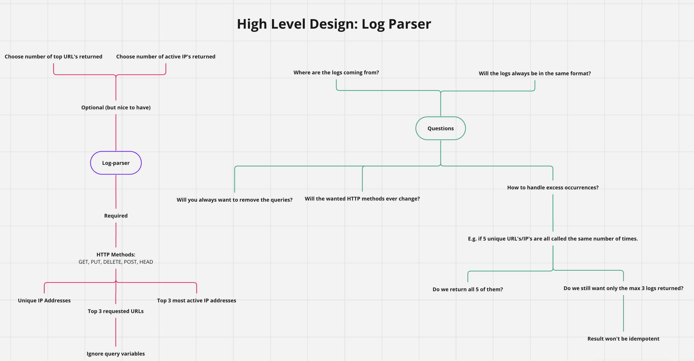

# Log Parser

## Overview

### High Level Design



Log Parser counts the unique IP addresses, top most requested URL's, and the most active IP addresses for the following HTTP methods:

```text
GET, PUT, DELETE, POST, HEAD
```

[Config](config/config.json) can be configured with different inputs.
Currently:

- the max number of requested IPs/URLs to return
  - both are set to 3
- regex pattern to match
  - only matches IP's and URLS(ignore queries) with the above HTTP methods
- File path to the logs
  - logs/log_file.log

The format of the logs will need to be in:

```text
$client_ip $_...... "$http_method $request_path $_......
```

E.g

```text
177.71.128.21 - - [10/Jul/2018:22:22:08 +0200] "GET /blog/2018/08/survey-your-opinion-matters/ HTTP/1.1" 200 3574 "-" "Mozilla/5.0 (Windows NT 6.1; WOW64) AppleWebKit/536.6 (KHTML, like Gecko) Chrome/20.0.1092.0 Safari/536.6"
```

## Assumptions/Designs

Initial Design

- Log Parser will always be in the same format
- Logs stored in logs/log_file.log
- Will always want to ignore a query
- HTTP methods wanted is `GET, PUT, DELETE, POST, HEAD`
- Returns the exact number of requested numbers (default 3 for both URL's and IP's)
- Loads up the entire file and parses it (can be improved by streaming as input)

Design 2.0:

- Improve regex by using: <https://regex101.com/>
- Extend log file to open up more sources - i.e be passed in as a stream

## Dependencies

### Install Go version 1.22

<https://golang.org/doc/install>

#### On macs: go can be installed through homebrew

brew install go@1.22

### Makefile

Should be installed in most UNIX like systems.

## Makefile steps

To build and test the application:

```sh
make all
```

To run the application:

```sh
make run
```

Run all tests:

```sh
make test
```

Remove all compiled executables instance

```sh
make clean
```

> [!TIP]
Please see the Makefile for all commands.
